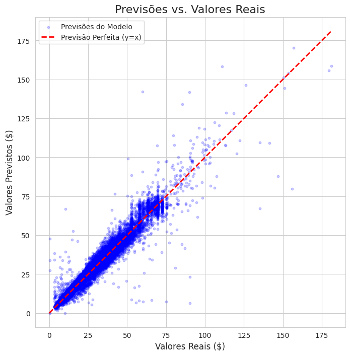

# Regressão Linear com Rede Neural: Previsão de Tarifas de Táxi em NY

Este projeto implementa um modelo de regressão com redes neurais (usando PyTorch) para prever o valor total das corridas de táxi em Nova York. O destaque da análise é a utilização de **estratificação geográfica** (bairros e zonas) e **segmentação temporal** para enriquecer as features do modelo, alcançando um coeficiente de determinação ($R^2$) de **0.9729** no conjunto de teste.


*(Sugestão: Adicione um print do seu gráfico de "Previsões vs. Valores Reais" a uma pasta `images` e o insira aqui)*

---

## 📋 Índice
* [Visão Geral](#-visão-geral)
* [Fonte de Dados](#-fonte-de-dados)
* [Metodologia](#-metodologia)
* [Resultados](#-resultados)
* [Como Executar o Projeto](#-como-executar-o-projeto)
* [Tecnologias Utilizadas](#-tecnologias-utilizadas)

---

## 🎯 Visão Geral
O objetivo principal é construir um modelo preditivo robusto que estime o `total_amount` de uma corrida de táxi com base em suas características, como distância, localização, horário e duração. A análise explora como a demanda e os preços variam drasticamente entre diferentes bairros de Manhattan, Brooklyn, etc., e em diferentes horários (pico, madrugada).

## 📊 Fonte de Dados
O dataset utilizado é o **NYC Yellow Taxi Trip Data**, disponibilizado publicamente no Kaggle pela NYC Taxi & Limousine Commission.
* **Link:** https://www.kaggle.com/datasets/elemento/nyc-yellow-taxi-trip-data
* **Arquivo específico:** `yellow_tripdata_2015-01.csv`. Foi utilizada uma amostra de 500.000 registros para o estudo, devido a limitações de processamento no ambiente Colab.
* O shapefile das zonas de táxi de NYC foi obtido diretamente do site da NYC TLC.

## 🛠️ Metodologia
O projeto foi estruturado nas seguintes etapas:
1.  **Análise Exploratória e Limpeza de Dados:** Identificação e remoção de dados inconsistentes, como corridas com distância ou valor nulos/negativos e coordenadas geográficas inválidas.
2.  **Engenharia de Features:**
    * **Temporais:** Extração de hora, dia da semana e mês do início da corrida.
    * **Geoespaciais:** Utilização da biblioteca `GeoPandas` para realizar um *spatial join* entre as coordenadas de embarque/desembarque e o shapefile das zonas de táxi, criando features de bairro e zona.
3.  **Pré-processamento:** Normalização de features numéricas (`StandardScaler`) e codificação de features categóricas (`OneHotEncoder`).
4.  **Modelagem com PyTorch:** Construção de uma rede neural com 4 camadas densas e funções de ativação ReLU.
5.  **Treinamento:** O modelo foi treinado por 50 épocas usando o otimizador Adam e a função de perda MSELoss.
6.  **Avaliação:** O desempenho foi medido no conjunto de teste com as métricas MSE, RMSE e R-squared.

## 📈 Resultados
O modelo final alcançou os seguintes resultados no conjunto de dados de teste:
* **Mean Squared Error (MSE):** 3.44
* **Root Mean Squared Error (RMSE):** $1.86 (o erro médio das previsões é de aprox. $1,86)
* **R-squared (R²):** **0.9729** (o modelo explica aproximadamente 97,29% da variância nos valores das corridas)

## 🚀 Como Executar o Projeto

**Pré-requisitos:**
* Python 3.8+
* Jupyter Notebook ou Jupyter Lab

**Passos:**
1.  Clone este repositório:
    ```bash
    git clone [https://github.com/SEU-USUARIO/SEU-REPOSITORIO.git](https://github.com/SEU-USUARIO/SEU-REPOSITORIO.git)
    cd SEU-REPOSITORIO
    ```
2.  Crie e ative um ambiente virtual (recomendado):
    ```bash
    python -m venv venv
    source venv/bin/activate  # No Windows: venv\Scripts\activate
    ```
3.  Instale as dependências:
    ```bash
    pip install -r requirements.txt
    ```
4.  **Download dos Dados:**
    * Baixe o arquivo `yellow_tripdata_2015-01.csv` do link do Kaggle acima.
    * Crie uma pasta `data` dentro do projeto e coloque o arquivo `.csv` nela.
5.  Execute o notebook:
    ```bash
    jupyter notebook Projeto_1_DL_Completo.ipynb
    ```

## 💻 Tecnologias Utilizadas
* Python
* Pandas & NumPy para manipulação de dados
* Scikit-learn para pré-processamento
* PyTorch para o modelo de Deep Learning
* GeoPandas & Shapely para análise geoespacial
* Matplotlib & Seaborn para visualização
* Statsmodels para análise estatística (VIF)